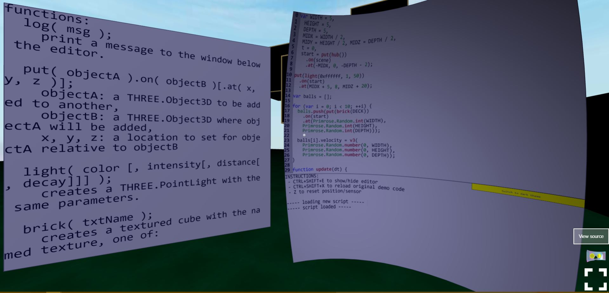
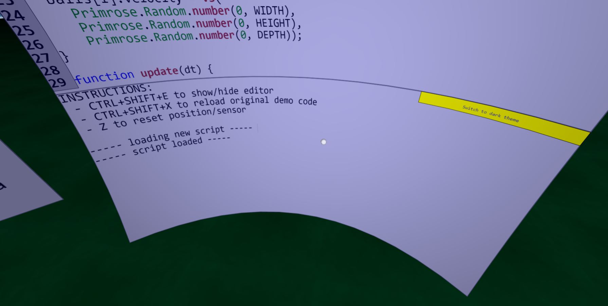
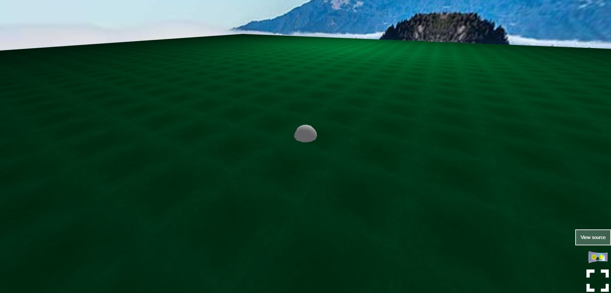
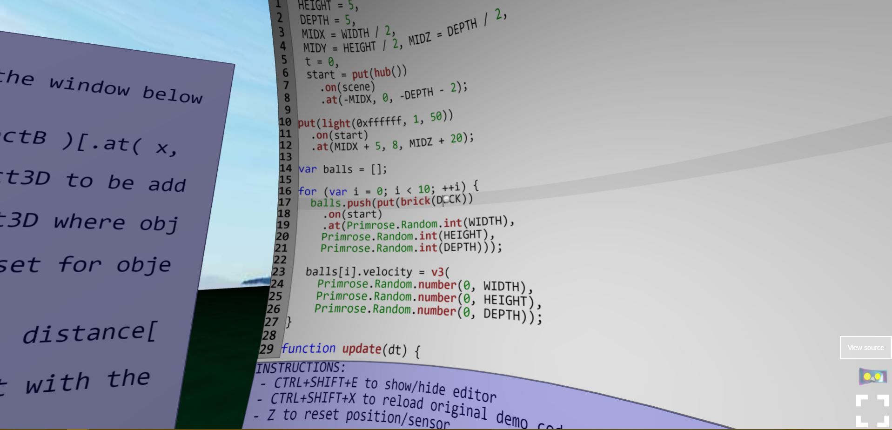

# Using the VR Development Environment

Primrose is not just a web development framework. It also provides a virtual reality,
live-programming environment for rapid prototyping and exploratory programming.
You can try out the [VR Editor](/examples/editor3d/index.html) now.

**Keep in mind:** there are two separate interaction modes in the VR Editor. You
switch between these modes by clicking on different objects in the environment:
* Navigation Mode - mouse clicks and keyboard events move your body around the environment.
* Editing Mode - mouse clicks and keyboard events edit text within the Code Editor, 
  but do not cause changes in your body's location.

## Dev Zone Layout

Off the bat, there are three text areas visible at approximately arm's distance.
We call this the "Dev Zone". It contains the interfaces you will use to read documentation,
write code, and see debugging output as you work.

> You may reset your view to return to the center of the Dev Zone and zero your
> headset's position and orientation sensors by hitting the <kbd>Z</kbd> key on
> your keyboard.

### Writing in the Code Editor

The VR Editor starts in a blank space with a small demo script already loaded in
the editor. The center text area is the code editor. It is rendered on the inside
of a portion of a sphere, what we call a "shell". Rendering the code to the inside
of a sphere means that all points of the editor will be equidistant from your viewing
point when you are standing in front of the editor, helping to reduce distortion
and make for a more comfortable reading experience.

> You may reset the editor and reload the original demo code at any time by hitting
> <kbd>CTRL+SHIFT+X</kbd> on Windows/Linux or <kbd>CMD+SHIFT+X</kbd> on OS X.

Editing text in the Code Editor supports most of the common keyboard shortcuts that 
you have grown accustomed to in other text editors:
* <kbd>Arrow keys</kbd> to move around.
* <kbd>CTRL+Left/Right Arrow keys</kbd> on Windows/Linux, or <kbd>ALT+Left/Right Arrow keys</kbd>
  on OS X to skip backwards/forwards by tokens.
* <kbd>CTRL+Up/Down Arrow keys</kbd> on Windows/Linux to scroll the document window without moving the text cursor (not supported on OS X).
* <kbd>Page Up/Page Down</kbd> to move by whole screens of text.
* <kbd>Home/End</kbd> on Windows/Linux, or <kbd>CMD+Left Arrow/Right Arrow key</kbd> to jump to the beginning or end of a line of text.
* <kbd>CTRL+Home/End</kbd> on Windows/Linux, or <kbd>CMD+Up Arrow/Down Arrow key</kbd> to jump to the beginning or end of the document.
* <kbd>SHIFT</kbd> plus one of the movement commands above to select text.
* <kbd>CTRL+A</kbd> on Windows/Linux or <kbd>CMD+A</kbd> on OS X to select all text.
* <kbd>CTRL+C</kbd> on Windows/Linux or <kbd>CMD+C</kbd> on OS X to copy text.
* <kbd>CTRL+X</kbd> on Windows/Linux or <kbd>CMD+X</kbd> on OS X to cut text.
* <kbd>CTRL+V</kbd> on Windows/Linux or <kbd>CMD+V</kbd> on OS X to paste text.
* <kbd>CTRL+Z</kbd> on Windows/Linux or <kbd>CMD+Z</kbd> on OS X to undo changes.
* <kbd>CTRL+Y</kbd> on Windows/Linux or <kbd>CMD+SHIFT+Z</kbd> on OS X to redo changes that were undone.
* <kbd>SHIFT+Delete</kbd> to delete an entire line.

> The displaying of the Dev Zone may be toggled at any time by hitting <kbd>CTRL+SHIFT+E</kbd>
> on Windows/Linux or <kbd>CMD+OPT+E</kbd> on OS X

### Documentation Window

To the left of the Code Editor is the Documentation Window. For now, it's a static,
read-only listing of the scripting functions that are available for using in the
Code Editor. Eventually, it will become a live-query-able terminal for all of the
documentation within Primrose.

### Console Window

To the right of the Code Editor is the Console Window. For now, it's a static,
read-only printing from whenever you call the `log()` function with a String parameter
in the Code Editor, as well as a description of any errors that occurred during
script execution. Eventually, it will become a live-executable terminal for
both logging and REPL code execution, exactly the same as the JavaScript Console
in your browser's Developer Tools view.

## Selection Sphere

At the center of your view is a small sphere. This is your cursor--we call it the
"Selection Sphere". It will follow your mouse, or--if you are not using a mouse--it 
will follow your head movements as you look around. The Selection Sphere performs
different actions when activated in different contexts.

There are several ways to activate the Selection Sphere:
* clicking the <kbd>left mouse button</kbd>,
* tapping anywhere on the screen,
* depressing the bumper on your Google Cardboard,
* tapping the <kbd>A</kbd> button on your Xbox 360 controller, or
* hitting the <kbd>Enter</kbd> key on your keyboard.

### Navigating with the Selection Sphere
When you point the Selection Sphere to the ground, it turns white and grows in size.
Activating the Selection Sphere will make you jump to that position. Additionally,
if you are currently in Editing Mode, activating the Selection Sphere while pointing
at the ground will switch you to Navigation Mode.

> Experience has shown that "blink" style movement between locations is the most
> reliable for avoiding nausea for people prone to simulator sickness while using 
> a VR headset.

There are a few additional ways to navigate the environment:
* <kbd>WASD</kbd> keys on the keyboard, a common system from First Person Shooter
  video games,
* <kbd>Arrow-keys</kbd> on the keyboard, a simple fallback for <kbd>WASD</kbd> both
  for people who prefer arrow keys and supporting the [Steam Controller](http://store.steampowered.com/app/353370/),
* <kbd>left analog stick</kbd> on your Xbox 360 gamepad.

### Making Text Selections with the Selection Sphere
When you point the Selection Sphere at a text area, it turns white and shrinks in
size. If you are currently in Navigation Mode, activating the Selection Sphere
will switch you to Editing Mode.

Once in Editing Mode, depressing a button to begin activating the Selection Sphere
will move the text cursor to that location and begin a text selection.

You may then move the Selection Sphere, dragging out a text selection. Releasing
the button to activate the Selection Sphere will set the end of the text selection.

### Canceling Edit Mode without Navigating
If there is no object under the Selection Sphere, it will turn red and shrink in
size. If you are currently in Editing Mode, activating the Selection Sphere at
this point will put you in Navigation Mode. If you are already in Navigation Mode,
activating the Selection Sphere will have no effect.

## Scripting

<under construction>

* [`axis()`](#axis)
* [`box()`](#box)
* [`brick()`](#brick)
* [`cloud()`](#cloud)
* [`cylinder()`](#cylinder)
* [`fill()`](#fill)
* [`fmt()`](#fmt)
* [`hub()`](#hub)
* [`light()`](#light)
* [`put()`](#put)
* [`quad()`](#quad)
* [`range()`](#range)
* [`shell()`](#shell)
* [`textured()`](#textured)
* [`v3()`](#v3)